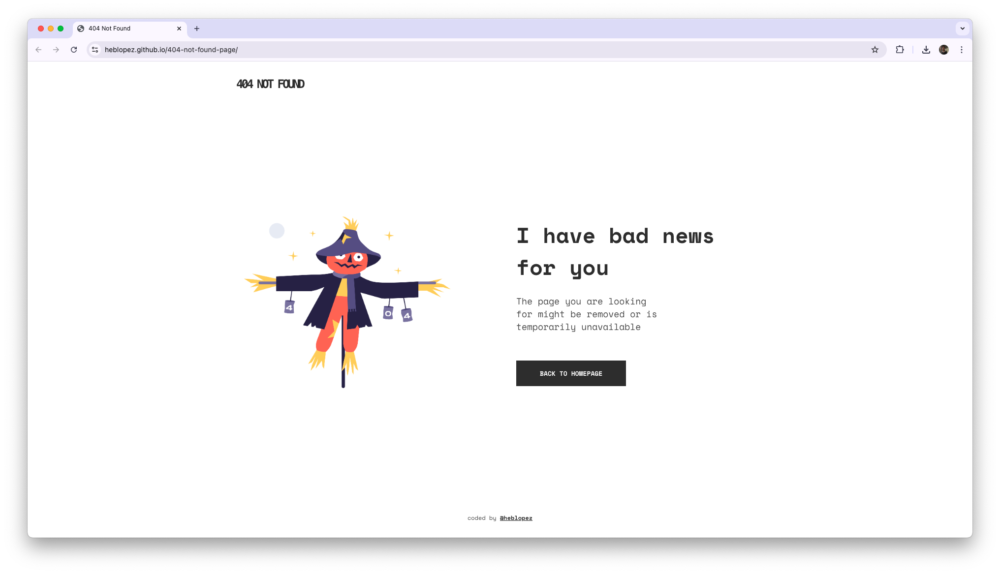

# Make It Real - 404 Not Found Page

This is a solution to the **404 Not Found Page** project of the Make It Real course.

## Table of contents

- [Overview](#overview)
  - [The challenge](#the-challenge)
  - [Screenshots](#screenshot)
- [My process](#my-process)
  - [Built with](#built-with)
  - [What I learned](#what-i-learned)
  - [Continued development](#continued-development)
  - [Useful resources](#useful-resources)
- [Author](#author)
- [Acknowledgments](#acknowledgments)

## Overview

### The challenge

- Build the basic structure of the page with HTML.
- Apply styles to the page using CSS following the layouts indicated in the "design" folder.

### Screenshots



## My process

### Built with

- Semantic HTML5 markup
- CSS custom properties
- Flexbox
- Mobile-first workflow

### What I learned

This project helped me especially to reinforce what I learned about responsive design following the mobile first approach.

```html
<body>
  <header>
    <h1>404 Not Found</h1>
  </header>
  <main></main>
  <footer></footer>
<body>
```
```css
@media (min-width: 768px) {
  body {
    display: flex;
    flex-direction: column;
  }

  main {
    display: flex;
    flex: auto;
    align-items: center;
    width: 100%;
    gap: 2rem;
  }
}
```

### Continued development

Working on this project made me realize that there are still advanced CSS topics to learn, and at the same time it sparked my interest to use Github Pages more often for static page deployment.

### Useful resources

- [Quickstart for GitHub Pages](https://docs.github.com/en/pages/quickstart) - This is a guide to deploy static pages using the GitHub pages service, which allows you to easily publish your website online in a few steps.

## Author

- Website - [Heberth López](https://www.heblopez.web.app)

## Acknowledgments

A special thanks to the MakeItReal team for the knowledge and support provided in each class and the feedback received on each project.
